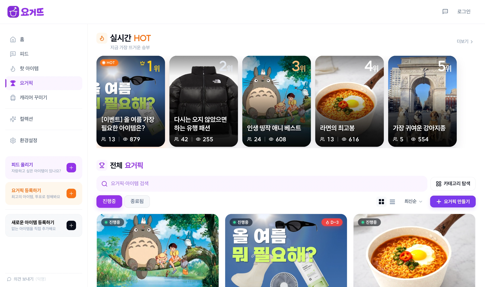
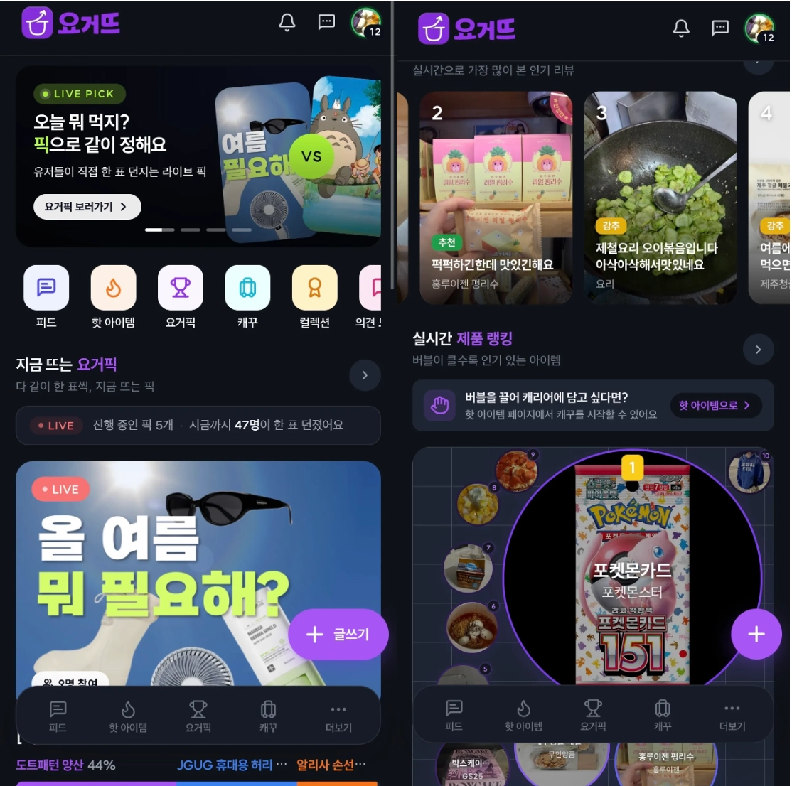
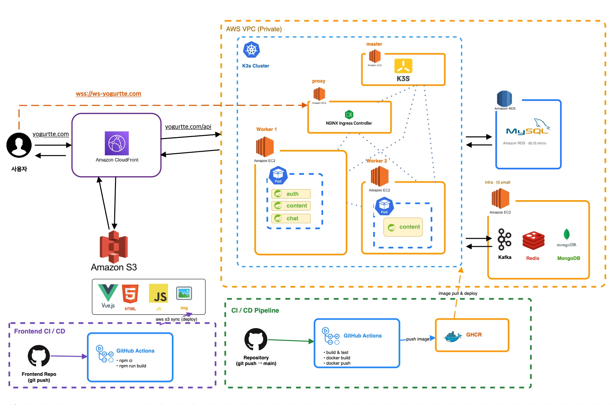
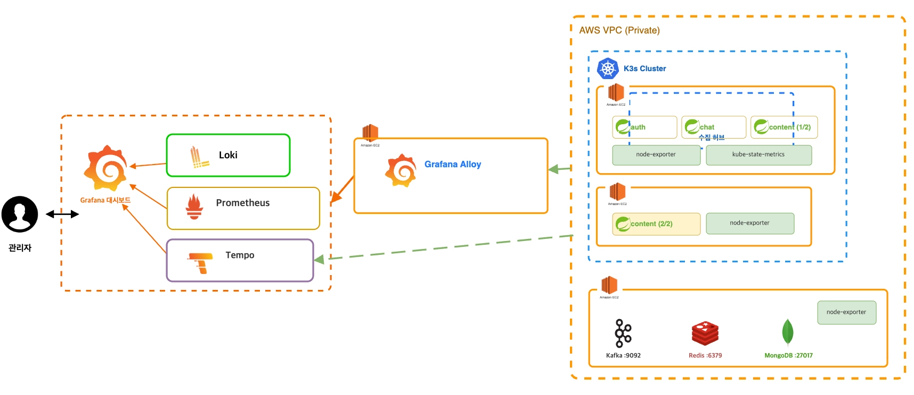

<div align="center">

# 🧳 요거뜨 (Yogurtte) — Content Service

**"오늘 뭐 먹지? 픽으로 같이 정해요"** — 투표 배틀과 아이템 피드로 즐기는 라이프스타일 커뮤니티

[yogurtte.com](https://yogurtte.com)


</div>

---

## 📌 소개

**요거뜨**는 유저들이 아이템(제품)을 놓고 **투표 배틀(요거픽)** 로 겨루고, **피드**에 한줄평을 남기고, 나만의 **캐리어를 꾸미며** 노는 커뮤니티 서비스입니다.

이 레포는 그중 **콘텐츠 서비스(content-service)** 입니다. 전체 백엔드는 인증, 콘텐츠, 채팅 세 개의 서비스로 나뉘어 있는데, 그중 배틀과 피드, 제품, 보상 등 서비스의 중심 도메인을 맡아 전체 트래픽의 약 70%를 처리합니다.

### 요거뜨 서비스 구성

| 레포 | 역할 |
|---|---|
| [toy-client](https://github.com/Minchae0322/toy-client) | Vue 3 프론트엔드. 웹과 iOS/Android 앱(Capacitor)을 하나의 코드로 서빙 |
| [toy-auth-user-region](https://github.com/Minchae0322/toy-auth-user-region) | 회원, 인증, 소셜 로그인, 팔로우, 알림 설정 |
| **toy-content** (이 레포) | 배틀, 피드, 제품, 보상 등 콘텐츠 도메인 |
| [toy-chat](https://github.com/Minchae0322/toy-chat) | 실시간 채팅과 푸시 알림 발송 |

| 웹 | 모바일 |
|:---:|:---:|
|  |  |

---

## ✨ 주요 기능

| 기능 | 설명 |
|---|---|
| **요거픽 (투표 배틀)** | 아이템을 두고 투표로 승부를 가리는 배틀. 1인 1표, 1인 3표, 스와이프 세 가지 방식이 있고 로그인 없이 게스트로도 참여할 수 있습니다. |
| **스와이프 배틀** | 아이템을 한 장씩 넘기며 강추, 픽, 패스로 평가하는 방식. 중간에 나가도 이어서 할 수 있고, 같은 아이템을 다시 평가해도 점수가 중복 집계되지 않습니다. |
| **피드** | 직접 써본 제품의 한줄평과 인증을 올리는 공간. 리액션, 댓글 스레드, 해시태그, 신고를 지원합니다. |
| **핫 아이템 / 실시간 랭킹** | 최근 반응일수록 높은 가중치를 주는 점수 모델로 인기 배틀과 피드, 제품을 주기적으로 집계합니다. |
| **캐리어 꾸미기** | 스킨과 아이템, 스티커로 나만의 캐리어를 꾸밉니다. |
| **한입만** | 대용량 제품을 나눠 사고파는 소분 마켓. 일반 판매, 공동구매, 대리구매까지 지원합니다. |
| **보상 시스템** | 활동하면 EXP가 쌓이고 레벨이 오릅니다. 뱃지, 일일 미션, 연속 인증 스트릭, 배틀 결과 예측 보상으로 참여를 유도합니다. |
| **알림** | 댓글이나 투표 같은 이벤트가 생기면 Kafka로 알림을 발행합니다. 트랜잭션 커밋 이후에만 발행하므로 취소된 행동에 대한 알림이 나가지 않습니다. |

---

## 🏗️ 시스템 아키텍처

AWS VPC 안의 **K3s 클러스터**(EC2 3대) 위에서 auth / content / chat 3개의 Spring Boot 서비스가 동작합니다. 프론트엔드(Vue.js)는 S3 + CloudFront로 서빙되고, API 트래픽은 NGINX Ingress를 거쳐 각 서비스로 라우팅됩니다.



- **Frontend** — Vue.js 정적 빌드를 S3에 올리고 CloudFront로 서빙합니다.
- **Backend** — K3s 클러스터(master 1, worker 2)에서 auth, content, chat 파드가 동작하며 content는 2 replica로 운영합니다.
- **Data** — MySQL(Amazon RDS), Redis, Kafka를 사용합니다. MongoDB는 chat 서비스 전용입니다.
- **CI/CD** — main에 푸시하면 GitHub Actions가 이미지를 빌드해 GHCR에 올리고, 매니페스트 레포의 kustomize 이미지 태그를 갱신해 GitOps 방식으로 배포됩니다. 문제가 생기면 커밋 SHA를 지정해 되돌리는 [롤백 워크플로](.github/workflows/rollback.yml)를 따로 두었습니다.

### 서비스 경계

| 서비스 | 책임 | 이 레포와의 관계 |
|---|---|---|
| **content** (이 레포) | 배틀, 피드, 제품, 보상 등 콘텐츠 도메인 전반과 알림 발행 | — |
| auth-service | 회원, 팔로우, JWT 발급 | JWT는 공유 시크릿으로 이 서비스에서 직접 검증합니다. 사용자 정보는 API로 조회하고 Redis에 캐시하며, 조회에 실패하면 fallback 사용자로 대체합니다. |
| chat-service | 실시간 채팅 | 한입만 판매글의 채팅방 수 집계에 연동합니다. |

---

## 🔍 관측성 (Observability)

Alloy 수집기 하나로 3개 서비스의 메트릭, 로그, 트레이스를 모두 모아 Grafana Cloud로 보냅니다.



- **Metrics** — Micrometer로 수집한 지표를 Prometheus에 적재합니다. 응답 시간은 p50/p95/p99 히스토그램으로 남기고, Four Golden Signals 기준의 대시보드와 이메일 알림을 운영합니다.
- **Traces** — 요청 흐름을 Tempo에서 추적합니다. `@Observed`로 서비스와 스케줄러 메서드를 span 단위로 나누고, SQL 실행까지 자동 계측해 느린 쿼리를 트레이스에서 바로 찾을 수 있습니다.
- **Logs** — 모든 로그에 traceId와 userId를 심어, Loki의 로그에서 Tempo의 트레이스로(또는 반대로) 바로 넘어갈 수 있습니다.
- actuator는 관리 포트 8090으로 분리해 외부에 노출하지 않습니다.

> 구축 과정의 삽질과 의사결정 전체 기록: [docs/observability.md](docs/observability.md)

---

## 🛠️ 기술 스택

| 분류 | 기술 |
|---|---|
| Language / Framework | Java 17, Spring Boot 3.4.1, Spring Security, Spring Data JPA, QueryDSL |
| Database | MySQL(RDS), Redis — 캐시와 스케줄러 분산락(ShedLock)에 사용 |
| Messaging | Apache Kafka — 알림 이벤트 발행, userId를 키로 사용자별 순서 보장 |
| Observability | Micrometer, Prometheus, Tempo, Loki, Grafana, Alloy |
| Infra | AWS EC2 · RDS · S3 · CloudFront, K3s, NGINX Ingress, Docker |
| CI/CD | GitHub Actions, GHCR, kustomize 기반 GitOps 배포 |
| Testing | k6 부하 테스트, Spring REST Docs |

---

## 📂 프로젝트 구조

```
src/main/java/com/example/toycontent
├── app
│   ├── battle          # 요거픽 투표 배틀 — 투표 방식별 정책, 게스트 참여, 투표 감사 로그
│   ├── feed            # 제품 한줄평 피드와 리액션, 댓글 스레드
│   ├── product         # 제품 카탈로그와 등록 승인 플로우, 인기도 집계
│   ├── carrier         # 캐리어 꾸미기
│   ├── oneMouth        # 한입만 마켓 — 판매 유형별 옵션 처리
│   ├── reward          # EXP와 레벨, 뱃지, 미션, 스트릭 등 보상 체계
│   ├── notification    # 알림 이벤트 발행 (커밋 이후 Kafka로 전달)
│   ├── kafka           # Kafka 프로듀서
│   ├── scheduler       # 랭킹 갱신, 인기도 재계산, 마감 알림 배치
│   ├── auth            # JWT 검증 필터
│   ├── hashtag, category, file, feedback, dashboard, common, config
└── external
    └── user            # auth-service 사용자 조회 클라이언트
```

---

## 🚀 실행

```bash
# 빌드 (테스트 포함)
./gradlew build

# 로컬 실행 — MySQL/Redis 필요, Kafka는 kafka.enabled=false로 생략 가능
./gradlew bootRun --args='--spring.profiles.active=local'
```

- API 서버는 `http://localhost:8082/api` 에서 뜨고, Swagger UI를 제공합니다.
- actuator는 관리 포트인 `http://localhost:8090/actuator` 에서 확인할 수 있습니다.
